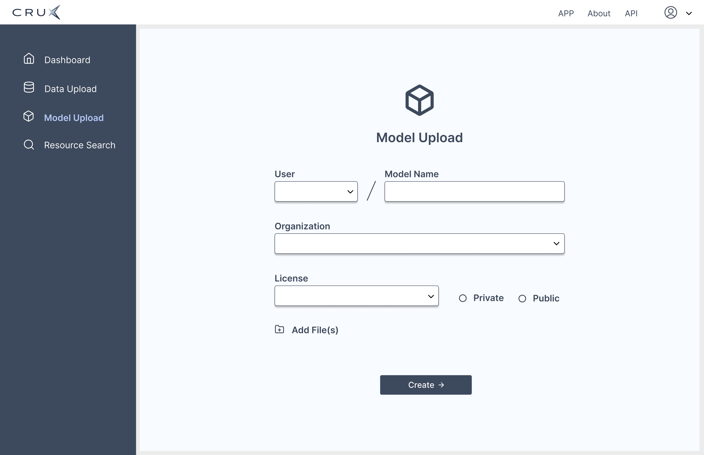
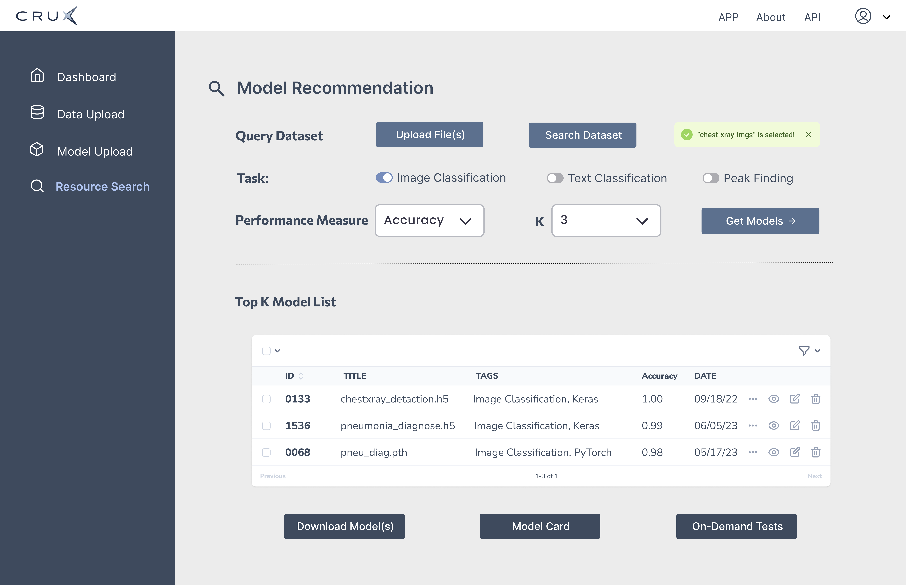

# ModsNet

## Interface






## Environment

Python 3.8

Pytorch >= 1.8

DGL >= 0.8

## Dataset


We include three built-in model repositories:

* **KIZoo**: Collected from Kaggle.

* **HFZoo**: Collected from HuggingFace.

* **PKZoo**: Generated by the XRD datasets from the CRUX community.

The processed bipartite graphs are available in HuggingFace: https://huggingface.co/datasets/wmying/model_selection

## Citation

<!-- If there is a paper or blog post introducing the dataset, the APA and Bibtex information for that should go in this section. -->

**BibTeX:**

```
@inproceedings{wang2023selecting,
  title={Selecting Top-k Data Science Models by Example Dataset},
  author={Wang, Mengying and Guan, Sheng and Ma, Hanchao and Bian, Yiyang and Che, Haolai and Daundkar, Abhishek and Sehirlioglu, Alp and Wu, Yinghui},
  booktitle={Proceedings of the 32nd ACM International Conference on Information and Knowledge Management},
  pages={2686--2695},
  year={2023}
}
